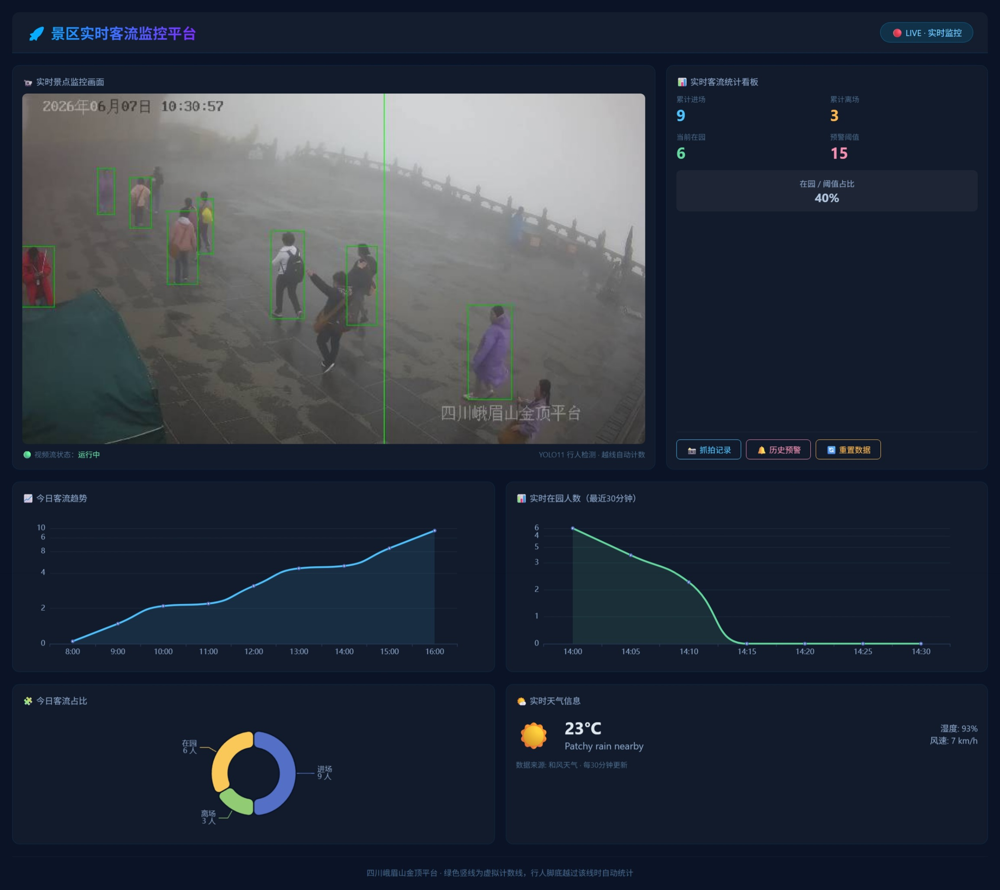

# 景区实时客流统计与预警系统

基于 YOLO11 + Django 的景区客流监测平台，支持实时行人检测、越线计数、超限预警和数据看板。

---

## 项目背景

景区客流管理是旅游行业的核心痛点之一。传统的人工计数方式效率低、误差大，无法实时掌握景区内游客分布情况。本系统通过计算机视觉技术，自动检测行人并统计进出人数，帮助景区管理人员实时了解客流动态，辅助决策。

---

## 核心功能

| 功能模块 | 说明 |
|----------|------|
| 实时监控 | 接入摄像头或本地视频流，实时检测行人 |
| 客流统计 | 通过虚拟计数线自动统计进场 / 离场人数 |
| 超限预警 | 在园人数超过阈值时自动触发预警 |
| 数据看板 | 展示实时客流数据、历史预警记录、天气信息 |
| 图表分析 | 展示当日客流趋势、实时在园人数曲线、客流占比 |
| 天气信息 | 接入和风天气 API，实时显示景区天气 |

---

## 技术栈

| 类别 | 技术 |
|------|------|
| 后端框架 | Django 4.x |
| 目标检测 | YOLO11 |
| 视频处理 | OpenCV |
| 数据库 | SQLite |
| 前端图表 | ECharts |
| 天气 API | 和风天气 |
| 编程语言 | Python 3.8+ |

---

## 项目结构

TourFlowSystem/
├── flowapp/ # 主应用
│ ├── migrations/ # 数据库迁移
│ ├── templates/ # HTML 模板
│ │ └── index.html # 主看板页面
│ ├── models.py # 数据库模型（抓拍记录、客流记录、预警记录）
│ ├── views.py # 视图逻辑（视频流、计数、预警、天气）
│ ├── urls.py # 路由配置
│ └── admin.py # 后台管理配置
├── yolov11_model/ # YOLO11 模型文件
│ └── yolo11n.pt # 行人检测模型
├── manage.py # Django 入口
├── requirements.txt # 项目依赖
└── README.md # 项目说明

---

## 运行方式

```bash
# 1. 克隆项目
git clone https://github.com/ZhouHailing/TourFlowSystem.git
cd TourFlowSystem

# 2. 安装依赖
pip install -r requirements.txt

# 3. 运行项目
python manage.py runserver

访问 http://127.0.0.1:8000 即可看到主界面。


## 参数调优说明

在 `views.py` 中，以下关键参数可根据实际场景调整：

| 参数 | 默认值 | 说明 |
|------|--------|------|
| `PERSON_CONF` | 0.45 | 检测置信度阈值 |
| `MIN_BOX_H` | 70 | 最小检测框高度（像素） |
| `MIN_STABLE_FRAMES` | 5 | 目标稳定帧数 |
| `SPLIT_LINE_RATIO` | 0.58 | 计数线位置（画面比例） |
| `WARN_LIMIT` | 15 | 预警触发阈值 |


## 主要难点与解决方案

**1. 计数精度不足**

在早期测试中，部分行人未被准确计数，导致统计结果与实际客流存在偏差。通过以下优化措施，计数准确率得到明显提升：

- 在计数线附近设置判定缓冲区（`SPLIT_BUFFER`），避免因脚底点未精确越过绿线而漏计
- 降低稳定帧数要求（`MIN_STABLE_FRAMES` 从 12 调整为 5），使移动较快的目标也能被及时捕获
- 配合检测阈值（`PERSON_CONF`）和最小检测框高度（`MIN_BOX_H`）的联动调整，在检测灵敏度和误检率之间取得平衡

**2. 视频流与图表时间同步**

演示阶段采用本地视频文件作为输入源，图表时间轴与视频实际播放时间存在偏差。在真实摄像头场景下，图表会按实际时间戳实时更新，时间轴与监控画面保持一致。系统设计时已预留时间戳接口，支持后续对接真实监控设备。


## 项目截图

以下为系统运行时的部分界面截图：



说明：主看板包含实时监控画面、客流统计面板、ECharts 图表和实时天气信息。

## 许可证

MIT License